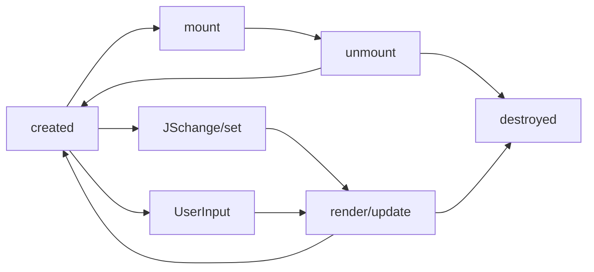

>前言:本文首发于[CSDN博客](https://blog.csdn.net/Blateyang/article/details/118115063)，是笔者参加极客大学前端训练营的学习笔记整理而来，主要介绍组件的基础知识并实现一个基础的轮播组件，这也是笔者在掘金发布的首篇技术博客，初来乍到，还请各位朋友多多支持^_^
## 1 组件化
### 1.1. 组件的基本知识
#### 1.1.1 前端两大重点内容
- 组件化：解决复用问题
- 架构模式：如MVC、MVVM等，解决前端和数据逻辑层的交互问题

#### 1.1.1.2 组件的理解
组件可以看作特殊的对象和模块，它和UI是强相关的，是可复用的界面功能模块。它除了具有对象的property,method,inherit之外，还有attribute,state,children,event等，下图描述了组件组成部分间的关系
#### 1.1.1.3 Attribute vs Property
- Attribute强调描述性
- Property强调从属关系
在html中，二者含义是不同的
```html
<input value="cute">
<script>
  var input = document.getElementByTagName("input"); // 若property没有设置，则结果是attribute
  input.value //cute
  input.getAttribute("value"); //cute
  input.value = "hello"; //若value属性已设置，则attribute不变，property变化，元素上实际的效果是property优先
  input.value // hello
  input.getAttribute("value"); //cute
</script>
```

#### 1.1.1.4 如何设计组件状态(?表示待定）

|   |Markup set|JS set| JS Change| User Input Change|
|---|---|---|---|---|
|property|x|√|√|?|
|attribute|√|√|√|?|
|state|x|x|x|√|
|config|x|√|x|x|

#### 1.1.1.5 生命周期Lifecycle



### 1.2 为组件添加jsx语法
#### 1.2.1 搭建支持jsx语法的环境
jsx是babel的插件，因此要依次安装webpack,babel-loader, babel和babel-plugin
1. 安装webpack，用于静态模块打包
```npm install -g webpack webpack-cli```

2. 安装babel-loader，用于将其他语言的代码转译成webpack能够识别的语言(js或json)
```npm install --save-dev webpack babel-loader```

3. 安装babel用于将新版本的js编译成旧版本的js以便能跑在旧版本的浏览器中
```npm install --save-dev @babel/core @babel/preset-env```

4. 安装react-jsx插件用于在js中能够使用jsx
```npm install --save-dev @babel/plugin-transform-react-jsx```

5. 安装完后还要在webpack.config.js中将安装的各种库填写进配置文件中，如下
```js
module.exports = {
  entry: "./main.js",
  module: {
    rules: [
      {
        test: /\.js$/,
        use: {
          loader: "babel-loader",
          options: {
            presets: ["@babel/preset-env"],
            plugins: ["@babel/plugin-transform-react-jsx"]
          }
        }
      }
    ]
  },
  mode: "development"
}
```
### 1.3 JSX的基本使用方法
#### 1.3.1 JSX的原理
利用babel/plugin-transform-react-jsx插件将html标签写法转换成创建dom树的函数调用`createElement(type, attributes, ...children)`
#### 1.3.2 createElement函数的基本实现
```js
function createElement(type, attributes, ...children) {
  let element = document.createElement(type)
  for(let attr in attributes) {
    element.setAttribute(attr, attributes[attr])
  }
  for(let child of children) {
    if(typeof child === "string") {
      child = document.createTextNode(child)
    }
    element.appendChild(child)
  }
  return element
}
```
#### 1.3.3 增加对自定义标签的支持
```js
function createElement(type, attributes, ...children) {
  let element
  if(typeof type === "string")
    element = document.createElement(type)
  else 
    element = new type()
  for(let attr in attributes) {
    element.setAttribute(attr, attributes[attr])
  }
  for(let child of children) {
    if(typeof child === "string") {
      child = document.createTextNode(child)
    }
    element.appendChild(child)
  }
  return element
}

class Div{
  constructor() {
    this.root = document.createElement("div")
  }
  setAttribute(name, value) {
    this.root.setAttribute(name, value)
  }
  appendChild(child) {
    this.root.appendChild(child)
  }
  mountTo(parent) {
    parent.appendChild(this.root)
  }
}

let a = <Div id="a">
  <span>a</span>
  <span>b</span>
  <span>c</span>
</Div>

// document.body.appendChild(a)
a.mountTo(document.body)
```

#### 1.3.4 给原生html标签添加包装类使其支持mountTo方法
```js
function createElement(type, attributes, ...children) {
  let element
  if(typeof type === "string")
    element = new ElementWrapper(type)
  else 
    element = new type()
  for(let attr in attributes) {
    element.setAttribute(attr, attributes[attr])
  }
  for(let child of children) {
    if(typeof child === "string") {
      child = new TextWrapper(child)
    }
    child.mountTo(element)
  }
  return element
}


class ElementWrapper{
  constructor(type) {
    this.root = document.createElement(type)
  }
  setAttribute(name, value) {
    this.root.setAttribute(name, value)
  }
  appendChild(child) {
        child.mountTo(this.root);
  }
  mountTo(parent) {
    parent.appendChild(this.root)
  }
}

class TextWrapper{
  constructor(content) {
    this.root = document.createTextNode(content)
  }
    setAttribute(name, value) {
    this.root.setAttribute(name, value)
  }
  appendChild(child) {
        child.mountTo(this.root);
  }
  mountTo(parent) {
    parent.appendChild(this.root)
  }
}

class Div{
  constructor() {
    this.root = document.createElement("div")
  }
  setAttribute(name, value) {
    this.root.setAttribute(name, value)
  }
  appendChild(child) {
        child.mountTo(this.root);
  }
  mountTo(parent) {
    parent.appendChild(this.root)
  }
}


let a = <Div id="a">
  <span>a</span>
  <span>b</span>
  <span>c</span>
</Div>

// document.body.appendChild(a)
a.mountTo(document.body)
```
## 2 动手实现一个轮播组件
```js
class Component {
  constructor(type) {
    // this.root = this.render()
  }
  setAttribute(name, value) {
    this.root.setAttribute(name, value)
  }
  appendChild(child) {
    this.root.appendChild(child)
  }
  mountTo(parent) {
    parent.appendChild(this.root)
  }
}

class Carousel extends Component{
  constructor() {
    super()
    this.attributes = Object.create(null) // 创建空对象接收src属性
  }

  setAttribute(name, value) { // 重写基类的方法，以便将src设置到组件中
    this.attributes[name] = value
  }

  render() {
//    console.log(this.attributes.src)
    this.root = document.createElement("div")
    this.root.classList.add("carousel")
    for(let item of this.attributes.src) {
      let img = document.createElement("div")
      img.style.backgroundImage = `url(${item})`
      this.root.appendChild(img)
    }

    let currentIdx = 0
    let time = 3000
    let children = this.root.children

    // 自动轮播， 每次只需移动viewport中的两张相邻图片
    let timer = setInterval(()=> {
      let nextIdx = (currentIdx + 1) % children.length

      let current = children[currentIdx]
      let next = children[nextIdx]
      // next快速移入viewport的后一个位置
      next.style.transition = "none"
      next.style.transform = `translateX(${100 - nextIdx*100}%)`

      setTimeout(()=>{// 实现current移出viewport,next移入viewport且next快速切换到current
          next.style.transition = "" // 恢复样式表中的transition设置
          current.style.transform = `translateX(${-100 - currentIdx*100}%)`
          next.style.transform = `translateX(${-nextIdx*100}%)`
        currentIdx = nextIdx
      }, 16) // 此处设置延时是为了避免立即覆盖前面对next的设置
    }, time)

    // 手动轮播
    let position = 0
    this.root.addEventListener("mousedown", (event) => {
      let startX = event.clientX
      console.log("mousedown")
      let move = (event)=>{
        console.log("mousemove")
        let x = event.clientX - startX
        let current = position
        for(let offset of [-1, 0, 1]) {
          let pos = current + offset
          pos = (pos + children.length) % children.length // 将索引-1变为3
          children[pos].style.transition = "none" // 拖动时关闭过渡效果
          children[pos].style.transform = `translateX(${-pos*500 + offset*500 + x%500}px)`
        }
      }
      let up = (event) => {
        let x = event.clientX - startX
        let current = position - Math.round(x/500) // 获取松手时就近的帧索引
        for(let offset of [0, Math.sign(Math.abs(x)>250 ? x:-x)]) { 
          // 拖动距离大于视口的一半，当前图片和下一张图片跟着移动，否则当前图片和上一张图片跟着移动
          let pos = current + offset
          pos = (pos + children.length) % children.length // 将索引-1变为3
          children[pos].style.transition = "" // 恢复过渡效果
          children[pos].style.transform = `translateX(${-pos*500 + offset*500}px)`
        }
        console.log("mouseup")
        document.removeEventListener("mousemove", move)
        document.removeEventListener("mouseup", up)
      }
      // 在document上监听可以防止移出图片区域无法响应监听事件
      document.addEventListener("mousemove", move)
      document.addEventListener("mouseup", up)
    })
    return this.root
  }

  mountTo(parent) {
    parent.appendChild(this.render())
  }
}
let d = ['https://res.devcloud.huaweicloud.com/obsdevui/diploma/8.1.17.002/banner-8.d14241daf518717981c6.jpg',
          'https://res.devcloud.huaweicloud.com/obsdevui/diploma/8.1.17.002/banner-1.fdbf82d4c2ca7fad3225.jpg',
          'https://res.devcloud.huaweicloud.com/obsdevui/diploma/8.1.17.002/banner-2.64b1407e7a8db89d6cf2.jpg',
          'https://res.devcloud.huaweicloud.com/obsdevui/diploma/8.1.17.002/banner-3.ce76c93c7a8a149ce2a2.jpg']
let a = <Carousel src={d}/>
a.mountTo(document.body)
```
注：自动轮播中下面两行代码目的是在每一次轮播时提前将下一张轮播图移到viewport右侧，以便在视觉上能够形成轮播的效果，如下图所示，a,b,c,d是四张图，每一行代表transform后的一次状态，虚线箭头表示transition为none时的移动过程
```js
      next.style.transition = "none"
      next.style.transform = `translateX(${100 - nextIdx*100}%)`
   ```


ps:如果觉得此文对你有帮助或启发，请顺手点赞和分享，这是对我的最大鼓励，如有疑问，请留言或私信交流，看到会及时回复
